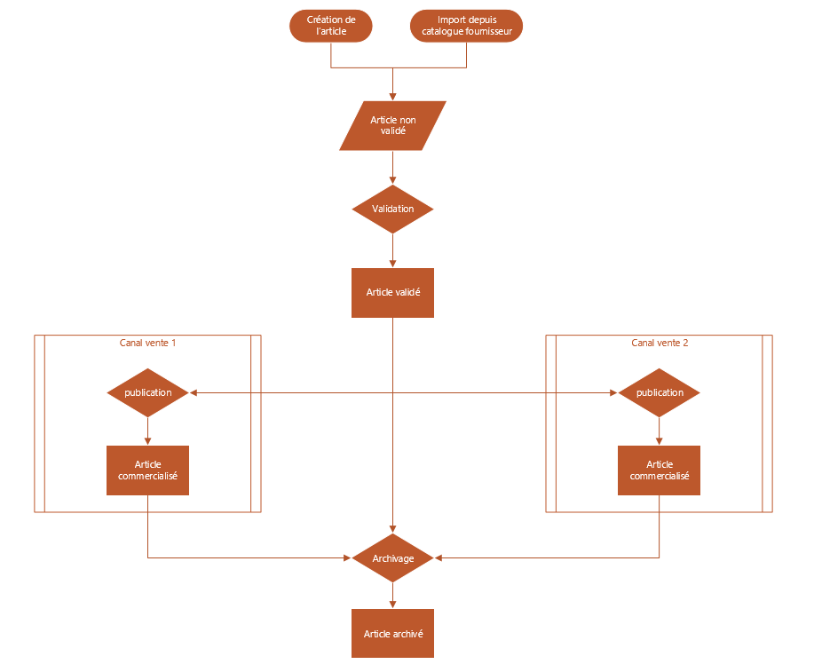

# Cycle de vie

Les articles passent par un certain nombre d'&eacute;tapes, au cours de leur existence dans nos outils.

Lorsque vous cr&eacute;ez un article, il est d'abord dans un phase d'&eacute;laboration, pendant laquelle l'article ne peut pas &ecirc;tre utilis&eacute; pour des op&eacute;rations de vente. Cette &eacute;tape vous permet de renseigner les informations n&eacute;cessaires &agrave; la bonne utilisation d'un article, de lui associer des documents, images, video, etc., d'en d&eacute;finir le tarif etc.

Une fois les informations renseign&eacute;es, vous pouvez valider un article puis le publier sur un ou plusieurs canaux de vente. Ces op&eacute;rations peuvent &ecirc;tre faites simultan&eacute;ment ou de fa&ccedil;on s&eacute;par&eacute;e. Un article valid&eacute; et publi&eacute; sur un canal de vente - par exemple : votre site e-commerce - sera visible sur celui-ci. En fonction de vos r&egrave;gles de gestion, il pourra &eacute;galement &ecirc;tre achet&eacute; ou command&eacute;.

Lorsque vous souhaitez retirer d&eacute;finitivement un article de votre catalogue produit, vous pouvez l'archiver : cette op&eacute;ration rendra l'article invisible dans tous vos outils et vos canaux de ventes.

<h2>Sch&eacute;ma du cycle de vie</h2>

