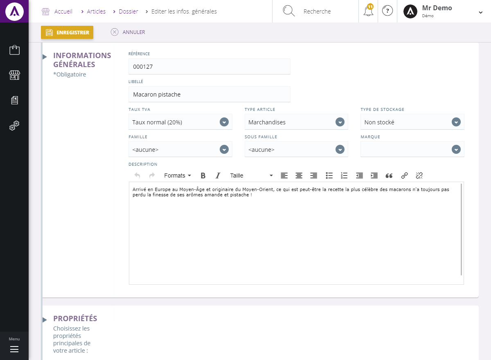
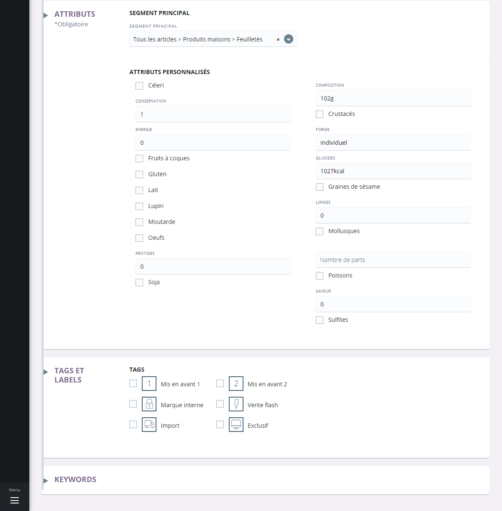

# Modifier les infos. générales

Ce formulaire va vous permettre de <strong>modifier les informations g&eacute;n&eacute;rales</strong> de votre article gr&acirc;ce &agrave; trois points distinct :

<ul>
<li><strong>Modification g&eacute;n&eacute;rale</strong> (r&eacute;f&eacute;rence, type d'article, type de stockage etc)</li>
<li><strong>Attributs</strong> (segmentation, code EAN)</li>
<li><strong>Tags et labels</strong> (mise en avant de l'article)</li>
</ul>

<h2>Modification g&eacute;n&eacute;rale et propri&eacute;t&eacute;</h2>

Cette premi&egrave;re partie du formulaire vous permettra de <strong>modifier les informations g&eacute;n&eacute;rales d'un article</strong> (description, famille, marque etc...) qui vous permettront de pr&eacute;senter votre produit ou encore d&eacute;finir son r&ocirc;le.

Vous pouvez voir dans cette premi&egrave;re partie de ce formulaire :

<ol>
<li><strong>R&eacute;ference de l'article</strong></li>
<li><strong>Le lib&eacute;ll&eacute;</strong></li>
<li><strong>Le taux de TVA</strong></li>
<li><strong>Le type d'articles</strong> (plusieurs proposition si votre articles appartient au types : marchandises, service etc...)</li>
<li><strong>Types de stockage</strong> (d&eacute;finit comment votre article peut &ecirc;tre stock&eacute;, ex:stock valoris&eacute; au PUMP)</li>
<li><strong>Une description </strong>(vous pouvez personnaliser votre d&eacute;scription avec quelques options de mise en forme telles que la couleurs,la taille du texte,ect...)</li>
<li><strong>La marque </strong>(KINDER, FERERRO...),</li>
<li><strong>Un ensemble de propri&eacute;t&eacute; permettant de modifier le r&ocirc;le de votre</strong> <strong>article</strong>.</li>
</ol>

- <em>Utilisable e-commerce </em>: rend votre article publiable&nbsp;et visible sur votre site e-commerce.

- <em>Article g&eacute;n&eacute;rique </em>: d&eacute;fini votre article comme &eacute;tant un " mod&egrave;le ", pouvant &ecirc;tre d&eacute;clin&eacute; en plusieurs versions (taille, coloris etc...)

&nbsp;

<h2>Attributs, tags et labels</h2>

La seconde parties du formulaire consiste &agrave; modifier les attributs et le r&ocirc;le de votre produit.

<h3>Le risque</h3>

Lorsqu'un produit est &agrave; risque, il faut une validation de commande pour&nbsp;que le client puisse continuer son achat.&nbsp;(1)

<h3>Les attributs</h3>

Les attributs correspondent aux crit&egrave;res permettant de retrouver un article via certains &eacute;l&eacute;ments, vous pouvez avoir : (2)

<strong>- Segement principal</strong>, l'ordre dans lequel vous pouvez retrouver votre article.

<strong>- Code EAN e-commerce</strong>, c'est le code barre de l'article.

<strong>- Garantie du produit,</strong>

<strong>- Mati&egrave;re de fabrication</strong> (plastique, polym&egrave;re etc...).

<strong>- Type de produit</strong> (utilisation, descriptif).

<h3>Tags et labels</h3>

Les tags et labels ont le r&ocirc;le de mettre en avant votre produit et de fournir des informations suppl&eacute;mentaires : (3)

- <strong>Un tag</strong> correspond &agrave; la mise en avant d'un article (promotion, vente flash, vente exclusif etc...).

- <strong>Un label</strong> correspond &agrave; une information suppl&eacute;mentaire (fabriqu&eacute; en .. etc).

<blockquote>

A savoir : les crit&egrave;res sont param&egrave;trables

</blockquote>

