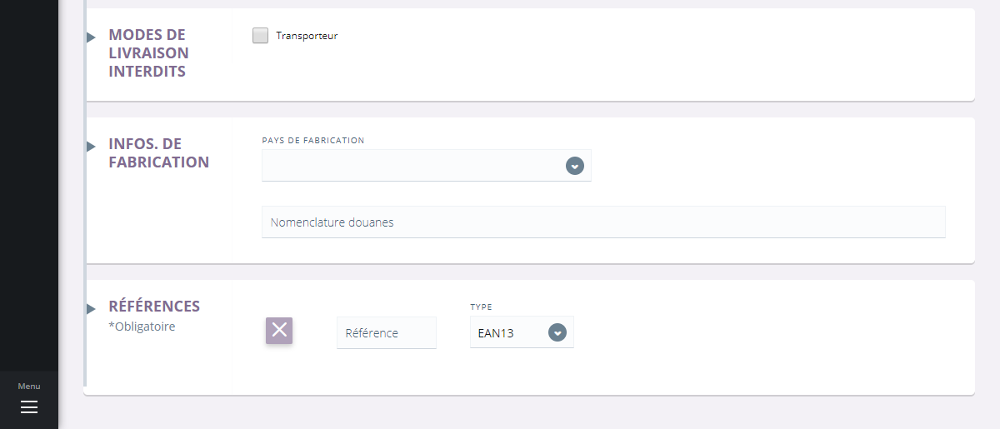

# Formulaire logistique

Ce formulaire va vous permettre de <strong>modifier les information logistique</strong> de votre article.

Vous pouvez <strong>r&eacute;&eacute;diter la dimensions </strong>et<strong> le poids</strong> de votre article, son <strong>mode de pr&eacute;paration</strong>, son <strong>stock disponible</strong> ou encore <strong>ses modes de livraisons autoris&eacute;s </strong>ou<strong> non</strong>.

&nbsp;

<h2>Modification des informations logistique</h2>

Dans ce formulaire de <strong>modification des informations logistique</strong>, vous pourrez modifier les <strong>dimensions</strong> et le <strong>poids</strong> de votre article ainsi que son <strong>mode de pr&eacute;paration</strong> et son <strong>stock</strong>.

Vous verrez aussi les diff&eacute;rents <strong>mode de livraisons</strong> (interdits), les <strong>informations de fabrication</strong> ou encore les <strong>r&eacute;f&eacute;rences</strong> de votre article.

<h3>Dimensions et poids</h3>

Gr&acirc;ce &agrave; ce formulaire, vous pouvez <strong>modifier les dimensions</strong> (<em>hauteur</em>, <em>largeur</em>, <em>profondeur</em>) <strong>brut</strong> ou <strong>net</strong> de votre article ainsi que son <strong>poids</strong>.

Ces informations vous permettront de d&eacute;finir le <strong>volume total</strong> de votre article et ainsi aider &agrave; la pr&eacute;paration et &agrave; l'envoi de votre produit.

<h3>Pr&eacute;paration de l'article</h3>

Dans cette partie du formulaire, vous pourrez pr&eacute;ciser le <strong>mode de pr&eacute;paration</strong> de votre article, comme :

- <strong>Pr&eacute;paration normale,</strong>

- <strong>Sur stock,</strong>

- <strong>Fabrication p&eacute;riodique stock&eacute;e.</strong>

Ou encore sa <strong>zone de pr&eacute;paration</strong>, qui consiste &agrave; indiquer l'endroit ou les commandes sont en pr&eacute;paration.

<h3>Stocks</h3>

Vous serez en mesure de modifier les <strong>stocks</strong> de votre article, comme :

- Le <strong>type d'approvisionnment</strong> du produit (manuels, avanc&eacute;s ...),

- La <strong>quantit&eacute; disponible</strong> ou <strong>non-disponible</strong>,

- La <strong>quantit&eacute; du stock r&eacute;serv&eacute;e</strong> (commande en cour, r&eacute;servation de produits...).

<h3>Modes de livraisons</h3>

Afin de ne pas d&eacute;t&eacute;riorer votre article durant la livraison, vous pouvez <strong>interdire certains modes de livraisons</strong>.

<blockquote>

A savoir : les modes de livraisons sont param&egrave;trables

</blockquote>
<h3>Informations douani&egrave;res</h3>

Ce crit&egrave;re consiste &agrave; <strong>d&eacute;clarer le pays de fabrication</strong> du produit (fabriqu&eacute; en...), vous pouvez par la m&ecirc;me occasion y inclure la <strong>nomenclature douani&egrave;re</strong> (type de cat&eacute;gorie de votre article, cat&eacute;gorie I, II, III, IV...).

<h3>R&eacute;f&eacute;rences</h3>

Pour identifier l'article, vous devez inclure les diff&eacute;rentes <strong>r&eacute;f&eacute;rences</strong> de votre produits comme :

- R&eacute;f&eacute;rence <strong>EAN 13</strong> (prix, produit...),

- R&eacute;f&eacute;rence <strong>fournisseur</strong>,

- R&eacute;f&eacute;rence <strong>magasin</strong>.

