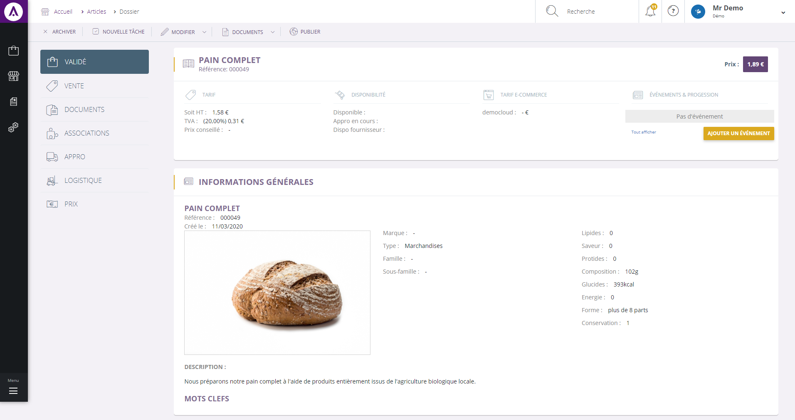
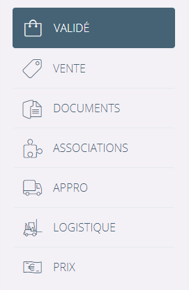

# Dossier article

Le **dossier article** présente toute les informations de votre produit regroupées par thème.

 En tête de page vous trouverez un résumé de la description de l'article.

Les blocs (visible sur votre gauche) vont vous permettre de visualiser **les détails de votre article** en cliquant sur l'un des thèmes.

Vous y trouvez : 

1.  [L'état](/fr-fr/office/gestion-commerciale/catalogue/articles/ongletprincipal.html),
2.  [Vente](/fr-fr/office/gestion-commerciale/catalogue/articles/ongletvente.html),
3.  [Documents](/fr-fr/office/gestion-commerciale/catalogue/articles/ongletdocument.html) (photos),
4.  [Articles associés](/fr-fr/office/gestion-commerciale/catalogue/articles/articlesassocier.html),
5.  [Préparation](/fr-fr/office/gestion-commerciale/catalogue/articles/ongletapprovisionnement.html) (approvisionnement de l'article, stock etc...),
6.  [Logistique](/fr-fr/office/gestion-commerciale/catalogue/articles/ongletlogistique.html) (dimensions de l'article, poids etc...),
7.  [Prix](/fr-fr/office/gestion-commerciale/catalogue/articles/ongletprix.html).

A côté de ces onglets vous trouverez un rectangle gris clair (sur votre droite) qui contient **les informations principales de l'article.**

Vous y trouverez : 

1.  Le libellé,
2.  La référence,
3.  Le prix HT du produit,
4.  La TVA,
5.  Le prix conseiller par le fournisseur,
6.  Les informations logistique (stock disponible, approvisionnement en cour, disponibilité chez le fournisseur),
7.  Le prix TTC (en promotion si il y a une promotion),
8.  Le site e-commerce ou l'article est en ligne.

Listes d'actions disponible
---------------------------

  
Le menu d'action près du titre, vous donnera accès aux actions suivantes :

 

**Archiver**

Permet d'archiver l'article: celui-ci ne sera plus disponible pour la vente.

**Modifier**

Permet de modifier le contenu de votre article.

 -  Informations générales

Permet de modifier les informations principales d'un article : libellé, description, informations comptables, attributs, tags & labels.

 -  Prix

Permet de définir les tarifs de vente de votre produit.

 -  Logistique

Permet de changer la dimension et le poids, modifier les quantités du stock, etc...

 -  Articles associés

Permet d'ajouter ou de supprimer des articles complémentaires, des versions.

 -  Edition e-commerce

Permet de modifier les information spécifique e-commerce : le prix , les options e-commerce et cross-canal, etc...

**Nouvelle tâche**

Permet de créer une nouvelle tâche.

**Publier**

Permet de gérer la présence de votre article sur vos sites e-commerce et cross-canal.

Evénements
----------

A la suite de cette liste d'action, vous pouvez trouver un **historique des événements survenus** sur l'article :

Cet historique présente les **événements** survenus sur l'article, les **modifications** importantes, _manuelles_ ou _informatiques_ y seront signalées.

Chaque événement correspond à une modification survenu sur l'article.

Par exemple :

**1** - Publication du produit sur le site e-commerce.

**2** - La modification du prix de l'article.