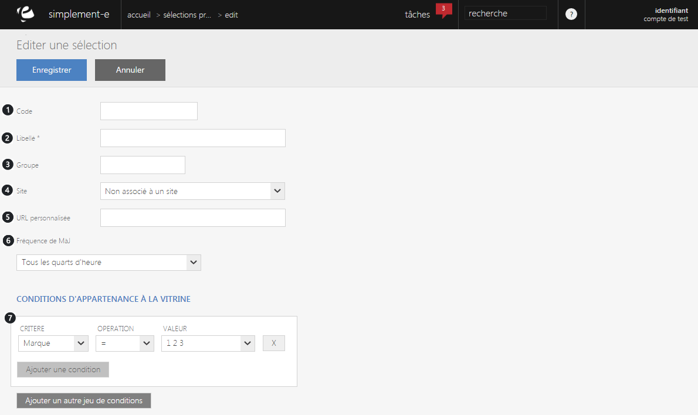

# Sélection automatique 

<h3>S&eacute;lection automatique</h3>

Si vous choisissez de <strong>cr&eacute;er une s&eacute;lection automatique</strong>, vous serez redirig&eacute; vers un <strong>formulaire</strong> vous permettant de d&eacute;buter la cr&eacute;ation de la nouvelle s&eacute;lection.

Une <strong>s&eacute;lection automatique</strong> cr&eacute;&eacute;e une action commerciale gr&acirc;ce aux <strong>crit&egrave;res d'appartenances</strong> (marque, r&eacute;f&eacute;rence...), ceci permet d'introduire tout les articles d'une m&ecirc;me famille (r&eacute;f&eacute;rence, marque...) dans une nouvelle s&eacute;lection.

<em>Par exemple</em>, en rentrant la marque Ferrero dans les conditions d'appartenance &agrave; l'op&eacute;ration, tout les produits Ferrero seront inclus dans une s&eacute;lection.

Vous pouvez trouver les crit&egrave;res suivant dans un formulaire :

<ol>
<li><strong>Code</strong> de la s&eacute;lection (r&eacute;f&eacute;rence),</li>
<li>Le <strong>titre</strong>,</li>
<li>Le <strong>groupe d'appartenance</strong> (publicit&eacute;, solde..),</li>
<li>Le <strong>site e-commerce</strong> ou la vitrine se trouve,</li>
<li><strong>L'URL personnalis&eacute;</strong> (optimisation de la recherche via les moteurs de recherche),</li>
<li><strong>La fr&eacute;quence de mise &agrave; jour de la vitrine.</strong></li>
<li><strong>Conditions d'appartenance</strong> &agrave; la vitrine.</li>
</ol>
<h3>Ajout d'un autre jeu de conditions</h3>

&nbsp;Vous pouvez aussi ajouter un autre jeu de condition ou une condition.

Le fait <strong>d'ajouter une condition va vous permettre de rajouter une ligne de crit&egrave;res</strong> qui vous permettront de <strong>rajouter un produit suppl&eacute;mentaire</strong> dans votre s&eacute;lection.

Vous pouvez voir par exemple :

<ol>
<li>Les <strong>crit&egrave;res d'appartenances</strong> (r&eacute;f&eacute;rences, disponibilit&eacute;, marque...),</li>
<li><strong>L'op&eacute;ration</strong> (en stock, &eacute;gal...),</li>
<li>La <strong>valeur du produit</strong>,</li>
<li>Un <strong>bouton de suppression</strong> de la condition,</li>
<li>Un <strong>bouton d'ajout</strong> d'une condition.</li>
</ol>
<blockquote>

A savoir : vous pouvez ajouter autant de ligne de condition que vous le souhaitez

</blockquote>

Les conditions vont&nbsp;vous permettre de <strong>choisir les produits que vous souhaitez mettre dans votre s&eacute;lection&nbsp;</strong>de fa&ccedil;on &agrave; ce que tout les articles, <em>par exemple</em>, d'une <strong>m&ecirc;me marque soit mis dans celle-ci</strong>.

Un des crit&egrave;res les plus important correspond &agrave;<strong> ajouter un autre jeu de conditions</strong> (B), &ccedil;a va vous permettre de <strong>cr&eacute;er un nouveau bloc de crit&egrave;res d'appartenance</strong>. (A)

<em>Par exemple</em>, ceci vous permettra de varier votre s&eacute;lection avec des produits similaires mais de diff&eacute;rentes marques.

&nbsp;Cet ajout vous permettra de cr&eacute;er de nouvelles conditions &agrave; la vitrine.

Vous pouvez aussi supprimer un bloc de condition, pour cela cliquez sur " <strong>Supprimer le groupe</strong> ". (C)

&nbsp;

