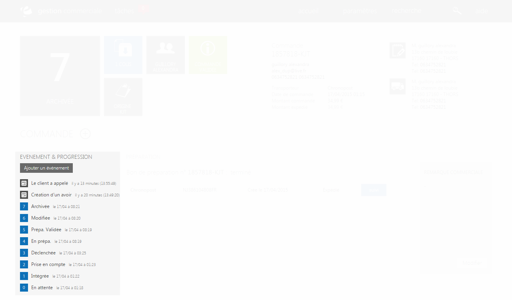

# Dossier commande

Le <strong>dossier commande&nbsp;</strong>pr&eacute;sente toute les <strong>informations de la commande client</strong>.

&nbsp;En t&ecirc;te de page vous trouverez un r&eacute;sum&eacute; de la description de l'article.

Les <strong>blocs</strong> (visible sur votre gauche) vont vous permettre de <strong>visualiser les d&eacute;tails de la commande,&nbsp;</strong>en cliquant sur l'un des th&egrave;mes.

Vous y trouvez :&nbsp;

<ol>
<li><a title="L'&eacute;tat de la commande" href="/fr-fr/office/gestion-commerciale/ventes/ongletprincipal.html"><strong>L'&eacute;tat de la commande</strong> </a>(annul&eacute;, valid&eacute;, termin&eacute; ou encour de pr&eacute;paration)</li>
<li>Les <a title="informations de la pr&eacute;paration" href="/fr-fr/office/gestion-commerciale/ventes/ongletpreparation.html"><strong>informations de pr&eacute;paration</strong> </a>du produit</li>
<li><a title="L'origine" href="/fr-fr/office/gestion-commerciale/ventes/origine.html"><strong>L'origine&nbsp;</strong></a>de la commande</li>
<li>Les <strong><a href="/fr-fr/office/gestion-commerciale/ventes/informationsurleclient.html">informations sur le client</a></strong></li>
<li>Les <strong><a href="/fr-fr/office/gestion-commerciale/ventes/informationsurletraitementdeslitiges.html">informations sur le traitement des litiges</a></strong></li>
</ol>
<blockquote>

A savoir : pour les informations compl&eacute;mentaires, le bloc devient rouge lorsque la commande et une commande &agrave; risque

</blockquote>

A c&ocirc;t&eacute; de ces blocs, vous trouverez un <strong>rectangle gris</strong> correspondant auux <strong>diff&eacute;rentes informations sur le client</strong>.

Vous pouvez y trouver :

<ol>
<li>Le <strong>num&eacute;ro de la commande</strong></li>
<li>Le <strong>nom du client</strong></li>
<li>Son <strong>num&eacute;ro de t&eacute;l&eacute;phone</strong></li>
<li>Les <strong>information sur la facturation</strong> (livraison, prix...)</li>
<li><strong>L'adresse de livraison</strong></li>
</ol>
<h3>Actions</h3>

Le <strong>menu&nbsp;d'action&nbsp;</strong>pr&egrave;s du titre vous permet d'acc&eacute;der &agrave; diff&eacute;rentes actions.

<em>Exemple</em> de commande que vous pouvez avoir :

<table>
<tbody>
<tr>
<td><strong><a href="/fr-fr/office/gestion-commerciale/ventes/interactionclient.html">Client </a></strong></td>
<td>Permet d'avoir des informations sur le client&nbsp;</td>
</tr>
<tr>
<td style="padding-left: 30px;"><a href="/fr-fr/office/gestion-commerciale/ventes/EnvoyerMail.html">- Envoyer un e-mail</a></td>
<td>Permet d'envoyer un e-mail au client</td>
</tr>
<tr>
<td style="padding-left: 30px;"><a href="/fr-fr/office/gestion-commerciale/ventes/DupliquerCommande.html">- Dupliquer la commande</a></td>
<td>Permet de dupliquer la commande</td>
</tr>
<tr>
<td style="padding-left: 30px;">- Connexion au site</td>
<td>Permet de vous connecter au site d'ou le produit vient</td>
</tr>
<tr>
<td style="padding-left: 30px;"><a href="/fr-fr/office/gestion-commerciale/ventes/changepassword.html">- Changer de mot de passe</a></td>
<td>Permet de changer de mot de pass</td>
</tr>
<tr>
<td><strong><a href="/fr-fr/office/gestion-commerciale/ventes/litiges.html">Litige </a></strong></td>
<td>Permet de connaitre les litiges&nbsp;</td>
</tr>
<tr>
<td style="padding-left: 30px;"><a href="/fr-fr/office/gestion-commerciale/ventes/avoir.html">- Etablir un avoir</a></td>
<td>Permet d'&eacute;tablir un avoir sur une commande&nbsp;</td>
</tr>
<tr>
<td style="padding-left: 30px;"><a href="/fr-fr/office/gestion-commerciale/ventes/CreationImpaye.html">- Commande impay&eacute;e</a></td>
<td>Permet de d&eacute;clarer&nbsp;une commande impay&eacute;e</td>
</tr>
<tr>
<td style="padding-left: 30px;"><a href="/fr-fr/office/gestion-commerciale/ventes/EditBagc.html">- Cr&eacute;er un bon d'achat</a></td>
<td>Permet de cr&eacute;er un bon d'achat pour un client</td>
</tr>
<tr>
<td><strong><a href="/fr-fr/office/gestion-commerciale/ventes/modifications.html">Modifier</a></strong></td>
<td>Permet de modifier une information</td>
</tr>
<tr>
<td style="padding-left: 30px;"><a href="/fr-fr/office/gestion-commerciale/ventes/SaisieReglements.html">- Saisie r&eacute;glement</a></td>
<td>Permet de modifier un moyen de paiement</td>
</tr>
<tr>
<td style="padding-left: 30px;"><a href="/fr-fr/office/gestion-commerciale/ventes/ApporteurCommande.html">- Apporteur d'affaire</a></td>
<td>Permet de conna&icirc;tre le recruteur de clients</td>
</tr>
<tr>
<td style="padding-left: 30px;"><a href="/fr-fr/office/gestion-commerciale/ventes/ModificationLivraison.html">- Modifier mode de livraison</a></td>
<td>Permet de modifier une adresse de livraison ou un moyen</td>
</tr>
<tr>
<td><a title="Nouvelle t&acirc;che" href="/fr-fr/office/gestion-commerciale/ventes/NewTodo.html"><strong>Nouvelle t&acirc;che</strong></a></td>
<td>Permet de cr&eacute;er une nouvelle t&acirc;che</td>
</tr>
<tr>
<td><strong><a href="/fr-fr/office/gestion-commerciale/ventes/AnnulationCommande.html">Annuler</a></strong></td>
<td>Permet d'annuler une commande</td>
</tr>
</tbody>
</table>

&nbsp;

<h3>Ev&eacute;nements et progression</h3>

A la suite de cette liste d'actions, vous trouverez un <strong>historique des &eacute;v&eacute;nements</strong> survenus sur cette commande.

Cet historique pr&eacute;sente les <strong>&eacute;v&eacute;nements survenus sur votre commande</strong> (changement d'adresse, demande d'avoir...).

Par <em>exemple</em> :

- La prise en compte de la commande avec la date et l'heure (2)

La pr&eacute;paration de votre commande est r&eacute;sum&eacute; en <strong>8 &eacute;tapes allant de 0 &agrave; 7</strong>, r&eacute;sum&eacute; dans cet historique.

Vous pouvez cr&eacute;er un &eacute;v&eacute;nement via le lien "<strong>Ajouter un &eacute;v&eacute;nement</strong>".

<blockquote>

A savoir : Les &eacute;tapes les plus longue sont les &eacute;tapes 2 et 4

L'&eacute;tape 2 correspond &agrave; la prise en compte du moyen de paiement

L'&eacute;tape 4 correspond &agrave; la pr&eacute;paration du produit

</blockquote>

&nbsp;

&nbsp;

