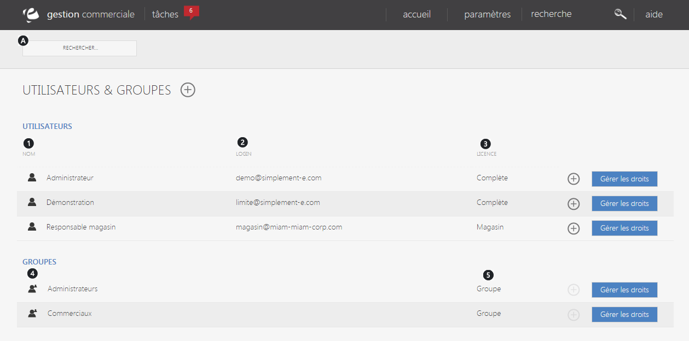

# Utilisateurs et groupes

Cette &eacute;cran de configuration vous permet de <strong>g&eacute;rer les droits des utilisateurs et des groupes</strong>.

Vous pouvez rechercher un utilisateur ou un groupe via la <strong>barre de recherche</strong> situ&eacute; sur le <strong>haut de la page</strong> (A).

<h3>Utilisateurs</h3>

Cette page vous donne acc&egrave;s &agrave; <strong>l'int&eacute;gralit&eacute; des utilisateurs</strong> et vous <strong>permet de g&eacute;rer leurs droits</strong>.

Vous pouvez apercevoir :

<ol>
<li>Nom de l'utilisateur,</li>
<li>Son identifiant,</li>
<li>Sa licence.</li>
</ol>

Vous pouvez <a title="modifier" href="/app/settings/VotreEntreprise/utilisateursdroitsautorisations/EditUser.aspx"><strong>modifier</strong></a>, <strong>archiver</strong> ou encore <a title="r&eacute;initialiser le mot de passe" href="/app/settings/VotreEntreprise/utilisateursdroitsautorisations/ReInitPassword.aspx"><strong>r&eacute;initialiser le mot de passe</strong> </a>d'un utilisateur via le <strong>menu d'action</strong> &agrave;&nbsp;droite de l'utilisateur.

Pour modifier les droits d'un utilisateur, cliquer sur le bouton bleu "<strong>G&eacute;rer les droits</strong>".&nbsp;

<h3>Groupes</h3>

Cet &eacute;cran vous permet d'acc&eacute;der aux <strong>diff&eacute;rents groupes d'utilisateurs</strong> ainsi qu'&agrave; la <strong>gestion de leurs droits.</strong>

Vous trouverez :

&nbsp;&nbsp;&nbsp;&nbsp;&nbsp; 4.&nbsp; Le nom du groupe.

&nbsp;&nbsp;&nbsp;&nbsp;&nbsp; 5.&nbsp; La licence sp&eacute;cifique &agrave; un groupe.

Vous pouvez modifier les droits du groupe, pour cela, cliquez sur "<a title="G&eacute;rer les droits" href="/app/settings/VotreEntreprise/utilisateursdroitsautorisations/EditAutorisation.aspx"><strong>G&eacute;rer les droits</strong></a>".

<blockquote>

A savoir : un groupe est un ensemble d'utilisateur

</blockquote>
<h3>Action</h3>

La&nbsp;<strong>commande d'action&nbsp;</strong>que vous pouvez apercevoir pr&egrave;s du titre, correspond au menu de commande. Il vous&nbsp;permet d'acc&eacute;der &agrave; diff&eacute;rentes actions qui vous permettront de g&eacute;rer vos articles.

<em>Exemple&nbsp;</em>de commande dont vous pouvez disposer :

<table>
<tbody>
<tr>
<td><strong><a href="/app/settings/VotreEntreprise/utilisateursdroitsautorisations/licences.aspx">G&eacute;rer les licences</a> </strong></td>
<td>&nbsp;Cette action permet de g&eacute;rer les licences des utilisateurs et p&eacute;riph&eacute;riques&nbsp;</td>
</tr>
<tr>
<td><strong>Nouveau :</strong></td>
<td>&nbsp;</td>
</tr>
<tr>
<td style="padding-left: 30px;"><strong>&nbsp;- <a href="/app/settings/VotreEntreprise/utilisateursdroitsautorisations/NouveauGroupe.aspx">Groupe</a></strong></td>
<td>&nbsp;Cette action permet de cr&eacute;er un nouveau groupe d'utilisateur</td>
</tr>
<tr>
<td style="padding-left: 30px;"><strong>&nbsp;- <a href="/app/settings/VotreEntreprise/utilisateursdroitsautorisations/NouvelUtilisateur.aspx">Utilisateur</a></strong></td>
<td>&nbsp;Cette action permet de cr&eacute;er un nouvel utilisateur</td>
</tr>
</tbody>
</table>

