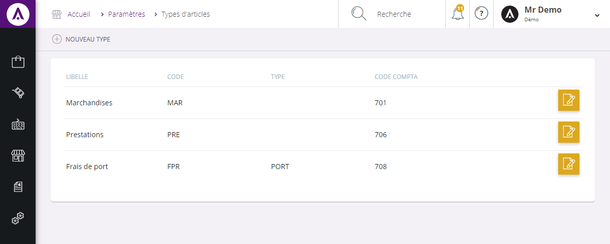

# Types d'articles

Les types d'articles correspondent aux diff&eacute;rentes prestations que vous pouvez apercevoir dans votre catalogue.

Vous pouvez avoir diff&eacute;rents type d'article dans votre catalogue, par exemple :

- <strong>Services</strong>,

- <strong>Marchandises</strong>,

- <strong>Prestations</strong>,

- Etc...

Dans cette page, vous pourrez <strong>visualiser vos diff&eacute;rents types d'articles</strong>, les <strong>modifier</strong> ou en <strong>cr&eacute;er de nouveaux</strong>.

Vous pouvez voir dans cette page :

<ol>
<li>Le libell&eacute; du type d'article (marchandise, prestation...),</li>
<li>Son code r&eacute;f&eacute;renciel,</li>
<li>Son type,</li>
<li>Son code comptable.</li>
</ol>

Afin de modifier les informations de votre type d'article, cliquez sur le bouton bleu "<strong>Modifier</strong>".

<h3>Actions</h3>

La&nbsp;<strong>commande d'action</strong>&nbsp;que vous pouvez apercevoir pr&egrave;s du titre, correspond au menu de commande. Il vous&nbsp;permet d'acc&eacute;der &agrave; diff&eacute;rentes actions qui vous permettront de g&eacute;rer vos articles.

<em>Exemple</em> de commande dont vous pouvez disposer :

<table>
<tbody>
<tr>
<td><a title="Nouveau type" href="/fr-fr/office/settings/catalogue/typesarticles/edit.aspx"><strong>Nouveau</strong> <strong>type&nbsp;</strong></a></td>
<td>Cette action vous permet de cr&eacute;er un nouveau type d'article</td>
</tr>
</tbody>
</table>

